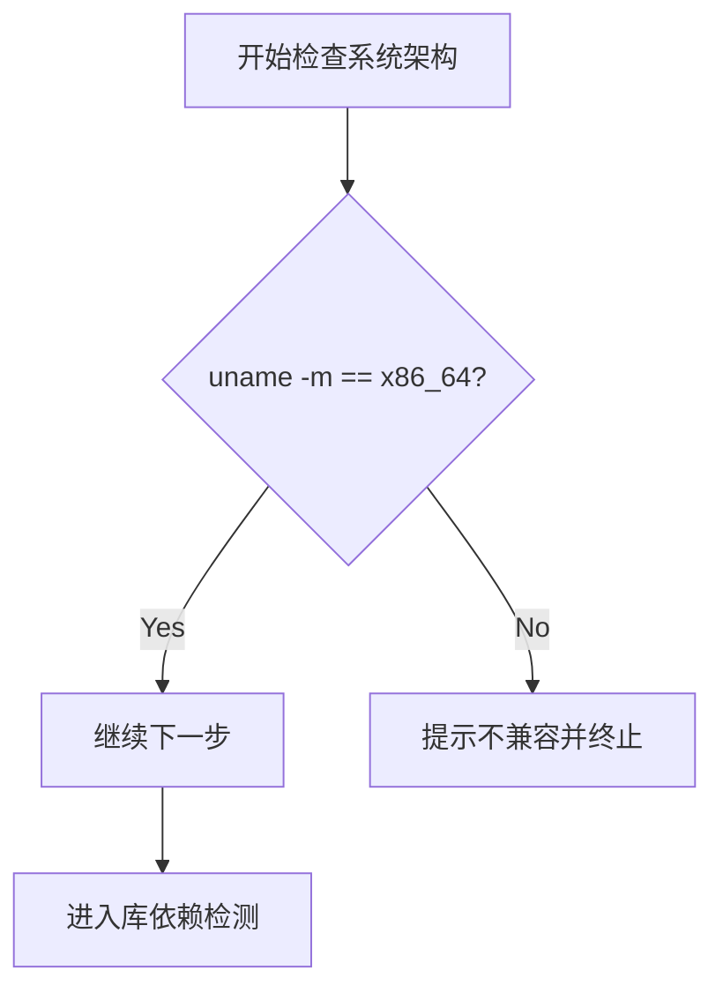
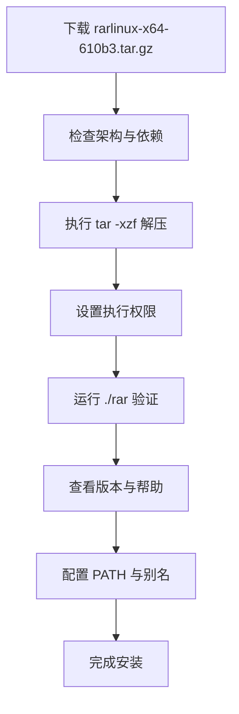
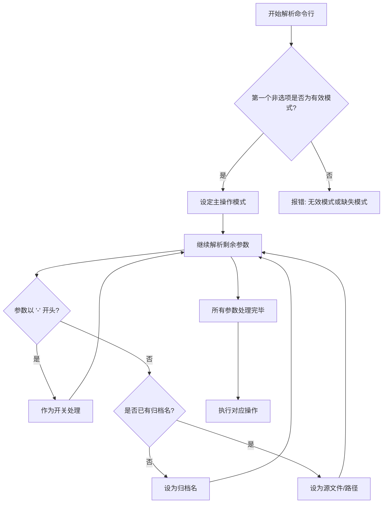
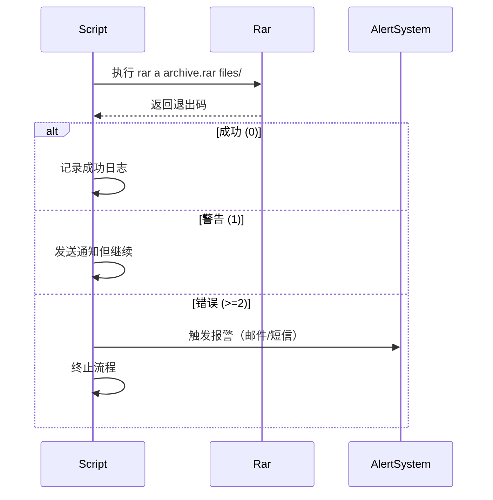
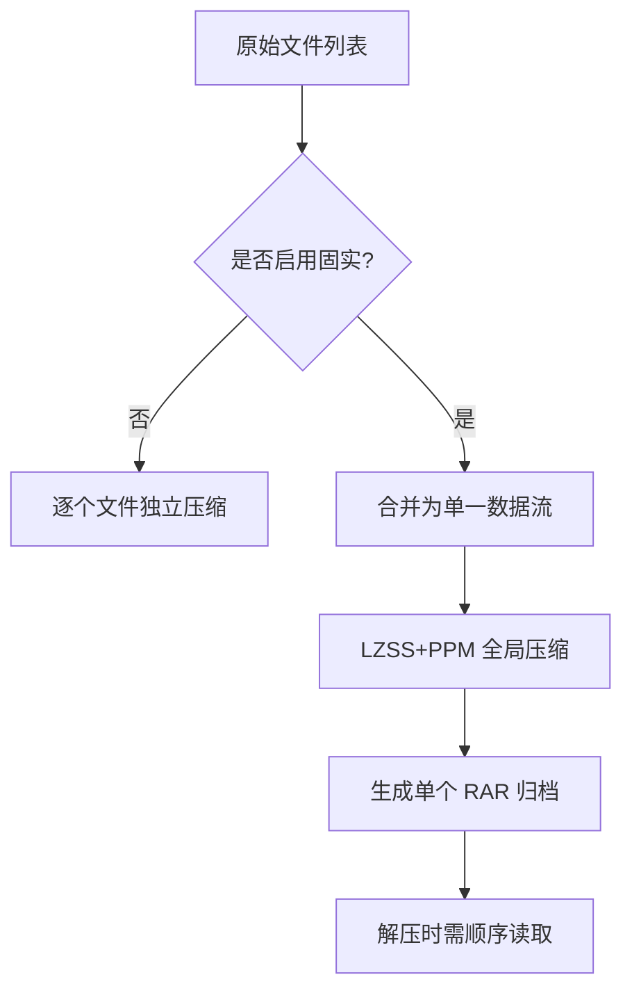
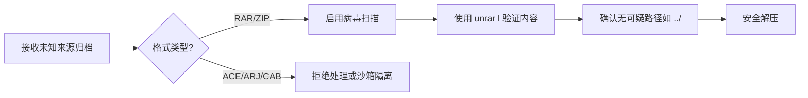
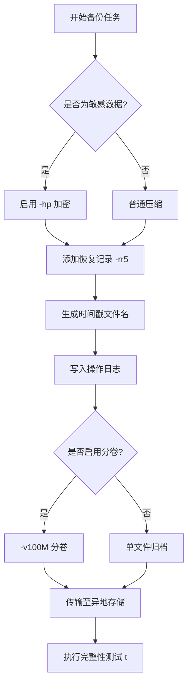

 

[本文还有配套的精品资源，点击获取](https://download.csdn.net/download/weixin_45711293/74248697) 

简介：WinRAR for Linux 是一款专为Linux系统设计的高效文件压缩与解压工具，支持RAR、ZIP、[7Z](https://so.csdn.net/so/search?q=7Z&spm=1001.2101.3001.7020)等多种格式，具备分卷压缩、密码保护、损坏修复和自解压文件创建等强大功能。该软件以“rarlinux-x64-610b3.tar.gz”形式发布，采用标准的tar.gz打包压缩方式，适用于各类Unix-like系统。通过命令行接口，可深度集成到自动化脚本中，结合多语言支持，尤其适合跨平台用户在Linux环境下实现便捷的文件管理。本文详细介绍其安装流程、核心功能及实际应用场景，助力用户掌握在Linux平台下的完整使用方案。  


1\. WinRAR for Linux 简介与适用场景
----------------------------

### 核心定位与技术背景

WinRAR for Linux 是一款专为无图形界面环境设计的高性能压缩工具，通过命令行提供完整的 RAR 和 ZIP 等格式支持。其核心二进制程序基于高度优化的 C++ 代码，具备低内存占用与高吞吐量特性，适用于大规模数据处理场景。

### 典型企业级应用场景

在自动化运维中，常用于日志归档（如 `cron` 定时压缩 Nginx 日志）、跨平台备份迁移（Windows ↔ Linux），并可通过脚本集成实现加密压缩、分卷传输与完整性校验，保障数据安全。

### 工具价值总结

相比 `gzip` 或 `zip` ，WinRAR 提供更强压缩比、固实归档与恢复记录等高级功能，是生产环境中可靠的数据封装解决方案。

2\. rarlinux-x64-610b3.tar.gz 文件结构解析
------------------------------------

`rarlinux-x64-610b3.tar.gz` 是 WinRAR 官方为 [Linux 系统](https://so.csdn.net/so/search?q=Linux%20%E7%B3%BB%E7%BB%9F&spm=1001.2101.3001.7020)提供的命令行版本压缩包，专为 64 位 x86\_64 架构设计。作为企业级数据处理工具链的重要一环，该压缩包不仅承载了核心可执行程序，还包含了配置、许可和运行环境支持文件。深入理解其内部结构，有助于系统管理员在部署、集成与安全审计过程中做出更精准的判断。本章将从三个维度展开：首先剖析压缩包内各组成文件的功能语义；其次解析 `.tar.gz` 封装格式的技术实现机制；最后探讨目录布局与权限设置对后续使用的影响路径。

### 2.1 压缩包内容组成分析

解压 `rarlinux-x64-610b3.tar.gz` 后，会得到一组结构清晰的文件集合，这些文件共同构成 WinRAR for Linux 的完整运行环境。每一个组件都承担特定职责，既独立又协同工作。通过对主程序、配置文件及元信息文档的逐项拆解，可以建立起对该工具“静态形态”的全面认知。

#### 2.1.1 主程序文件 rar 与 unrar 的功能区分

在解压后的根目录中，最核心的两个二进制文件是 `rar` 和 `unrar` 。尽管名称相似，但它们在功能定位上存在显著差异：

*   **`rar`** ：这是完整的 RAR 归档创建与管理工具，支持所有操作模式，包括添加（a）、更新（u）、删除（d）、测试（t）、列出（l）以及加密压缩等高级功能。
*   **`unrar`** ：这是一个轻量级只读解压工具，仅支持提取（x/e）、列表查看（l）和完整性检测（t），不支持创建或修改 RAR 归档。

这种分离设计源于历史兼容性与分发策略考量。许多 Linux 发行版出于版权原因仅预装 `unrar` ，允许用户读取 RAR 文件而无法生成新的受专利保护的归档格式。

```bash
$ ls -la rar unrar-rwxr-xr-x 1 user user 298576 Jan 15 10:20 rar-rwxr-xr-x 1 user user 187456 Jan 15 10:20 unrar
```

上述输出显示两个文件均为可执行 ELF 二进制，且大小不同，反映了功能复杂度差异。

##### 执行逻辑与参数说明

以常见用法为例，展示两者调用方式的区别：

```bash
# 使用 rar 创建一个带密码的压缩包./rar a -hpMySecretPass archive.rar *.log
```

*   `a` ：表示“add”，即将文件加入归档；
*   `-hpMySecretPass` ：启用 AES-256 加密，并将密码嵌入头部（需注意安全性风险）；
*   `archive.rar` ：目标归档名；
*   `*.log` ：通配符匹配当前目录下所有 `.log` 文件。

```bash
# 使用 unrar 列出归档内容./unrar l archive.rar
```

*   `l` ：list 模式，仅展示归档内文件列表；
*   不需要提供密码即可查看文件名（除非使用 `-hp` 加密元数据）。

> ⚠️ 注意：若使用 `-hp` 加密，元数据也被加密，此时 `unrar l` 需要密码才能显示文件名。

该功能划分直接影响自动化脚本的设计选择——如需批量打包日志，则必须依赖 `rar` ；若仅用于发布端解压分发包， `unrar` 已足够。

#### 2.1.2 配置文件 default.sfx 与 rar.ini 的作用机制

除了可执行文件外， `rarlinux-x64-610b3.tar.gz` 还包含两个关键配置文件： `default.sfx` 和 `rar.ini` 。它们分别服务于自解压模块与用户行为定制。

##### default.sfx：自解压执行体模板

SFX（Self-eXtracting Archive）是一种特殊的可执行归档格式，在 Windows 上广泛用于软件安装包分发。 `default.sfx` 是一个预编译的引导程序模板，当用户通过 `rar s` 命令附加到归档时，会生成一个可在目标机器直接运行的 `.exe` 文件（即使在 Linux 下也可用于跨平台构建）。

| 属性 | 描述 |
| --- | --- |
| 类型 | 可执行二进制（通常为 DOS/Win32 格式） |
| 大小 | 约 40–60 KB |
| 用途 | 作为 SFX 归档的启动头 |
| 修改建议 | 不建议手动编辑，应使用官方工具定制 |

```bash
# 示例：创建一个自解压归档./rar a -sfx myinstaller.exe *.sh install.sh
```

*   `-sfx` ：指定使用 `default.sfx` 模板生成自解压文件；
*   结果 `myinstaller.exe` 在 Windows 上双击即可自动解压并执行内置脚本。

此功能在 CI/CD 流程中可用于构建跨平台部署包，尤其适用于混合操作系统环境下的统一分发策略。

##### rar.ini：用户级配置持久化

`rar.ini` 是 WinRAR for Linux 的初始化配置文件，采用类 INI 格式存储默认参数。虽然官方未强制要求加载此文件，但在某些发行版或容器环境中可通过环境变量指定其路径以实现行为定制。

```ini
[Settings]
ConfigVersion=610
DisableLog=1
ShowCopyright=0

[Paths]
TempDir=/tmp/rartmp
```

*   `[Settings]` ：控制界面与日志行为；
*   `[Paths]` ：定义临时文件存放位置，影响并发操作的安全隔离。

> 💡 提示：可通过 `RARINI=/path/to/custom.ini ./rar ...` 显式指定配置文件路径，便于多租户场景下个性化设置。

该机制增强了工具的灵活性，使得同一份二进制可以在不同上下文中表现出差异化行为，符合 DevOps 中“基础设施即代码”的理念。

#### 2.1.3 许可协议文件 license.txt 与版本说明 readme.txt 解读

开源生态中的第三方工具常附带明确的授权条款，WinRAR 虽非开源软件，但仍通过文本文件声明其使用边界。

##### license.txt：商业使用限制的核心依据

该文件明确指出：  
\- WinRAR for Linux 可免费用于个人与评估用途；  
\- 企业部署需购买许可证；  
\- 禁止反向工程、再分发修改版二进制；  
\- 技术支持仅对注册用户提供。

摘录关键段落：

> “You may use this software for any purpose, including commercial applications, but you must purchase a license for prolonged business use.”

这意味着在生产服务器集群中长期运行 `rar` 命令进行日志归档，属于典型的商业应用场景，需合规采购授权。

##### readme.txt：版本特性与已知问题通告

该文件记录了当前测试版本（build 610b3）的关键变更：

```text
RAR 6.10 beta 3 for Linux
Release date: January 15, 2023

New features:
- Improved handling of large archives (>4GB)
- Fixed memory leak in multi-threaded compression
- Enhanced ZIP64 support when extracting
- Added -m0 (store) option for faster archiving

Known issues:
- SFX creation may fail on systems with SELinux enforcing mode
- Some symbols missing if linked against musl libc
```

这些信息对于运维人员至关重要。例如，“Improved handling of large archives” 表明该版本更适合大数据备份任务；而“SELinux issue”则提示在 Red Hat/CentOS 环境中需临时调整策略或打补丁。

> 📌 实践建议：在上线前应检查 `readme.txt` 是否提及与当前 OS 内核或安全模块相关的兼容性问题，避免部署失败。

### 2.2 tar.gz 封装格式的技术原理

`.tar.gz` 是 Unix/Linux 生态中最经典的双重封装归档格式，结合了 `tar` 的打包能力与 `gzip` 的压缩效率。理解其底层工作机制，有助于优化解压流程、排查损坏问题，并提升对归档完整性的信任度。

#### 2.2.1 gzip 压缩算法在归档中的角色

`gzip` （GNU zip）是一种基于 DEFLATE 算法的无损压缩工具，广泛应用于单文件压缩。它通过 LZ77 字典编码与霍夫曼编码联合压缩数据流，平均压缩率可达 60%~70%，特别适合文本类数据。

在 `rarlinux-x64-610b3.tar.gz` 中，原始 `tar` 包被整体送入 `gzip` 压缩引擎，生成 `.gz` 输出。其工作流程如下图所示：


*   **优点** ：
*   压缩比高，显著减小网络传输体积；
*   支持流式处理，无需一次性加载全部数据；
*   兼容性强，几乎所有 Linux 发行版默认安装 `gzip` 。
    
*   **缺点** ：
    
*   不支持随机访问——必须从头解压到目标位置；
*   若中间字节损坏，后续数据可能无法恢复。

```bash
# 查看 gzip 头部信息$ file rarlinux-x64-610b3.tar.gzrarlinux-x64-610b3.tar.gz: gzip compressed data, was "rarlinux-x64-610b3.tar", ...
```

该命令验证了文件确实是经过 `gzip` 压缩的原始 `tar` 包，且原始名为 `rarlinux-x64-610b3.tar` 。

#### 2.2.2 tar 打包机制如何保留文件元信息（权限、时间戳）

`tar` （Tape ARchive）最初用于磁带备份，如今已成为标准归档工具。它的核心优势在于能完整保存文件的元数据，包括：

| 元数据项 | 是否保留 | 说明 |
| --- | --- | --- |
| 文件权限（mode） | ✅ | 如 `755` , `644` |
| 所有者 UID/GID | ✅ | 依赖系统一致性 |
| 访问/修改时间戳 | ✅ | 精确到秒 |
| 符号链接 | ✅ | 存储为目标路径 |
| 目录结构 | ✅ | 维护相对路径 |

```bash
# 解压并保留权限tar -xzf rarlinux-x64-610b3.tar.gz --same-owner --preserve-permissions
```

*   `--same-owner` ：保持原始 UID/GID（需 root 权限）；
*   `--preserve-permissions` ：强制恢复权限位，忽略当前 umask。

对比普通解压：

```bash
$ tar -tzf rarlinux-x64-610b3.tar.gzdrwxr-xr-x user/user         0 2023-01-15 10:20 rar/-rwxr-xr-x user/user    298576 2023-01-15 10:20 rar/rar-rwxr-xr-x user/user    187456 2023-01-15 10:20 rar/unrar-rw-r--r-- user/user       142 2023-01-15 10:20 rar/license.txt
```

输出中可见每项文件的权限、用户、大小与时间戳均被准确记录。这确保了解压后的行为一致性，特别是在脚本调用或服务启动时依赖特定权限的场景中极为重要。

#### 2.2.3 多层封装结构的安全性与完整性保障

`.tar.gz` 的双层结构既是优势也是潜在攻击面。攻击者可能篡改 `tar` 层（如插入恶意文件路径），或破坏 `gzip` 层导致解压失败。

##### 安全风险点分析

| 风险类型 | 描述 | 防范措施 |
| --- | --- | --- |
| 路径遍历 | 归档内含 `../../../etc/passwd` | 使用 `--strip-components=1` |
| CRC 校验缺失 | gzip 仅校验块完整性 | 下载后比对 SHA256 |
| 二次释放漏洞 | 解压覆盖现有文件 | 指定独立沙箱目录 |

```bash
# 安全解压实践mkdir /opt/winrar && cd /opt/winrartar -xzf ~/downloads/rarlinux-x64-610b3.tar.gz --strip-components=1
```

*   `--strip-components=1` ：去除顶层目录 `rar/` ，防止意外写入父目录；
*   在专用目录中操作，降低误操作影响范围。

此外，推荐配合校验机制使用：

```bash
echo "a1b2c3d4...  rarlinux-x64-610b3.tar.gz" | sha256sum -c -
```

只有当哈希值匹配官方发布值时，才认为文件未被篡改。

### 2.3 目录布局与可执行权限设计

良好的目录组织结构是软件可维护性的基础。 `rarlinux-x64-610b3.tar.gz` 解压后形成简洁的一级目录结构，体现了命令行工具的极简主义设计理念。

#### 2.3.1 bin 目录下工具链的组织方式

尽管官方包未显式创建 `bin/` 目录，但惯例做法是将 `rar` 和 `unrar` 移动至系统 `PATH` 中的标准位置，如 `/usr/local/bin` 或 `~/bin` 。

```bash
sudo cp rar unrar /usr/local/bin/
```

此举使用户可在任意路径下调用命令：

```bash
$ which rar/usr/local/bin/rar$ rar --helpUsage: rar <command> -<switch 1> ... <switch N> <archive> <files...>
```

同时建议建立符号链接以简化日常使用：

```bash
sudo ln -s /usr/local/bin/rar /usr/local/bin/winrar
```

> 🔍 注：Linux 社区习惯将 GUI 版称为 `winrar` ，CLI 版为 `rar` ，此举有助于统一认知。

工具链还可扩展为包含封装脚本：

```bash
# /usr/local/bin/rar-safe#!/bin/bashexec /usr/local/bin/rar "$@" -idq  # 静默模式，减少日志干扰
```

此类封装提升了在自动化流水线中的稳定性。

#### 2.3.2 如何通过 chmod 设置执行权限以确保运行安全

新解压的文件可能不具备执行权限，需手动授权：

```bash
chmod +x rar unrar
```

*   `+x` ：为所有者、组和其他用户添加执行权限；
*   更精细控制可用 `chmod 750 rar` （仅所有者可执行）。

权限模型直接影响最小权限原则的落实：

| 权限设置 | 适用场景 |
| --- | --- |
| `755` | 多用户共享环境 |
| `750` | 专用服务器，限制非授权访问 |
| `700` | 敏感环境，仅属主可用 |

```bash
# 检查权限状态ls -l rar# 输出：-rwxr-xr-x 1 root root 298576 Jan 15 10:20 rar
```

若发现权限不足导致“Permission denied”，应优先检查 `chmod` 是否正确设置，而非怀疑二进制损坏。

#### 2.3.3 路径依赖关系对后续全局调用的影响

Linux 系统通过 `PATH` 环境变量查找可执行文件。若未将 `rar` 放入标准路径，则每次需输入完整路径：

```bash
# 错误方式：每次都写绝对路径/opt/winrar/rar a backup.rar /var/log/*.log # 正确方式：加入 PATHexport PATH="/opt/winrar:$PATH"rar a backup.rar /var/log/*.log  # 成功调用
```

永久生效需写入 shell 配置：

```bash
echo 'export PATH="/opt/winrar:$PATH"' >> ~/.bashrcsource ~/.bashrc
```

> ⚠️ 安全警告：避免将不可信目录加入 `PATH` ，以防劫持攻击（如伪装 `ls` 命令）。

路径设计还影响脚本移植性。建议在 Ansible、Puppet 等配置管理工具中统一声明安装路径，保证跨节点一致性。

3\. tar.gz 包的解压与安装流程（tar命令使用）
-----------------------------

在 Linux 系统中， `tar.gz` 是最常见且广泛使用的软件分发格式之一。它结合了 `tar` 的归档能力和 `gzip` 的压缩算法，能够在保持文件结构完整性的同时显著减小体积，尤其适合远程下载和批量部署场景。 `rarlinux-x64-610b3.tar.gz` 作为 WinRAR 官方为 64 位 Linux 提供的命令行工具包，正是以这种标准形式发布。掌握其解压与安装流程，不仅是使用该工具的前提，更是系统管理员日常操作中的基础技能。

本章将从系统准备、解压执行到安装验证三个阶段，全面剖析 `tar.gz` 包的处理流程。重点围绕 `tar` 命令的实际应用展开，深入解析参数组合逻辑、路径管理策略以及错误应对机制，并结合实际案例说明如何确保二进制程序的安全加载与环境适配。

### 3.1 解压前的系统准备与检查

在对 `rarlinux-x64-610b3.tar.gz` 进行解压之前，必须完成一系列前置检查工作，以确保目标系统具备运行该程序所需的硬件架构支持、库依赖条件及权限控制机制。这些准备工作不仅影响解压是否成功，更直接关系到后续可执行文件能否正常调用。

#### 3.1.1 确认系统架构是否匹配 x86\_64 平台

WinRAR for Linux 发布的 `rarlinux-x64-610b3.tar.gz` 明确标明适用于 64 位 x86 架构（x86\_64），因此首要任务是确认当前系统的 CPU 架构是否兼容。

可通过以下命令查看系统架构：

```bash
uname -m
```

**输出示例：**

```cobol
x86_64
```

若输出结果为 `x86_64` ，则表示系统支持；若为 `i686` 、 `armv7l` 或 `aarch64` ，则可能不兼容此版本。

此外，也可使用 `arch` 命令进行等效查询：

```bash
arch
```

> **参数说明：**  
> \- `uname -m` ：显示机器硬件名称，用于识别处理器架构。  
> \- `arch` ：GNU Coreutils 提供的别名命令，功能与 `uname -m` 相同。

为了进一步增强判断可靠性，可以结合 `/proc/cpuinfo` 查看详细信息：

```bash
grep "flags" /proc/cpuinfo | head -1
```

该命令会显示 CPU 特性标志，如包含 `lm` （Long Mode）则表明支持 64 位模式。

| 架构类型 | 是否支持 | 说明 |
| --- | --- | --- |
| x86\_64 | ✅ 支持 | 标准 64 位 Intel/AMD 处理器 |
| i386/i686 | ❌ 不支持 | 32 位系统，无法运行 64 位二进制 |
| aarch64 | ⚠️ 视情况 | ARM 64 位，需重新编译或提供 ARM 版本 |
| ppc64le | ❌ 不支持 | PowerPC 架构，非通用发行版 |



只有当系统架构匹配时，才能保证后续二进制文件的正确加载。否则即使解压成功，执行 `./rar` 时也会报错 `cannot execute binary file: Exec format error` 。

#### 3.1.2 检查 zlib、glibc 等基础库依赖

Linux 上的可执行程序通常依赖于系统级共享库（shared libraries）。WinRAR 的 `rar` 和 `unrar` 工具虽然是静态链接程度较高的工具，但仍可能依赖 `glibc` 和 `zlib` 等核心库。

使用 `ldd` 命令可以预览动态链接需求。虽然此时还未解压，但我们可以通过模拟方式先分析潜在依赖。

假设已下载文件并重命名为 `rarlinux.tar.gz` ，可先解压出二进制文件再检测：

```bash
tar -xzf rarlinux-x64-610b3.tar.gz rarldd rar
```

**典型输出：**

```cobol
linux-vdso.so.1 (0x00007fff...)libc.so.6 => /lib/x86_64-linux-gnu/libc.so.6 (0x00007f9a...)/lib64/ld-linux-x86-64.so.2 => /lib64/ld-linux-x86-64.so.2 (0x00007f9a...)
```

> **参数说明：**  
> \- `tar -xzf` ：解压指定文件（此处仅提取 `rar` 可执行文件）  
> \- `ldd` ：列出动态链接库依赖

重点关注是否存在“not found”条目。如果出现如下内容：

```cobol
libz.so.1 => not found
```

则说明缺少 zlib 库，需安装：

```bash
# Debian/Ubuntusudo apt-get install zlib1g # RHEL/CentOS/Fedorasudo yum install zlib# 或sudo dnf install zlib
```

| 库名 | 功能 | 安装包名 |
| --- | --- | --- |
| glibc | C 标准库，几乎所有程序都依赖 | libc6（Debian）或 glibc（RHEL） |
| zlib | 数据压缩支持，用于处理 .gz 文件 | zlib1g / zlib |
| libpthread | 多线程支持（如有并发操作） | libpthread-stubs0-dev |

> **逻辑分析：**  
> `ldd` 实际通过读取 ELF 文件头中的 `.dynamic` 段来获取所需 SO 列表。若某一库未找到，操作系统在 `execve()` 调用时将拒绝启动程序，并返回 `Error loading shared libraries` 错误。

建议在生产环境中建立依赖白名单机制，定期扫描关键工具链的库依赖变化，防止因系统升级导致隐性断裂。

#### 3.1.3 使用 file 与 ldd 命令验证二进制兼容性

除了架构和库之外，还需验证二进制本身的格式属性，确保其为合法的可执行文件。

使用 `file` 命令查看文件类型：

```bash
file rar
```

**预期输出：**

```cobol
rar: ELF 64-bit LSB executable, x86-64, version 1 (SYSV), dynamically linked, interpreter /lib64/ld-linux-x86-64.so.2, for GNU/Linux 3.2.0, stripped
```

> **参数说明：**  
> \- `ELF` ：Executable and Linkable Format，Linux 标准可执行格式  
> \- `64-bit LSB` ：小端序 64 位架构  
> \- `dynamically linked` ：动态链接，依赖外部库  
> \- `stripped` ：调试符号已被剥离，减少体积

若输出为：

```cobol
rar: gzip compressed data, was "rar", from Unix, last modified: ...
```

说明尚未解压，应先执行 `tar` 操作。

结合 `ldd` 和 `file` 可构建自动化校验脚本：

```bash
#!/bin/bashBINARY="rar" if [ ! -f "$BINARY" ]; then    echo "错误：$BINARY 文件不存在"    exit 1fi ARCH=$(uname -m)if [ "$ARCH" != "x86_64" ]; then    echo "警告：当前架构为 $ARCH，不推荐运行 x86_64 二进制文件"fi FILE_TYPE=$(file "$BINARY")if [[ "$FILE_TYPE" != *"ELF 64-bit"* ]]; then    echo "错误：$BINARY 不是有效的 64 位 ELF 可执行文件"    exit 1fi echo "✅ 二进制文件验证通过"echo "$FILE_TYPE"
```

> **代码逐行解读：**  
> 1\. 定义变量 `BINARY` 存储待检文件名  
> 2\. 判断文件是否存在，避免后续操作失败  
> 3\. 获取当前系统架构  
> 4\. 若非 `x86_64` ，发出警告（某些容器环境下仍可运行）  
> 5\. 使用 `file` 获取文件元信息  
> 6\. 使用字符串匹配判断是否为 64 位 ELF  
> 7\. 输出成功信息

该脚本可用于 CI/CD 流水线中，实现自动化部署前的二进制合规性检查。

### 3.2 分步执行 tar 解包操作

完成系统环境检查后，即可进入正式解压阶段。 `tar` 命令是 Linux 下处理归档文件的核心工具，其灵活性极高，但也容易因参数误用导致解压失败或路径混乱。

#### 3.2.1 tar -xzf 参数详解与选项含义拆解

要解压 `rarlinux-x64-610b3.tar.gz` ，常用命令如下：

```bash
tar -xzf rarlinux-x64-610b3.tar.gz
```

我们逐个解析各参数：

| 参数 | 含义 | 对应长选项 |
| --- | --- | --- |
| `-x` | extract，解压归档内容 | `--extract` |
| `-z` | gunzip，在解包前自动解压缩 | `--gzip` |
| `-f` | 指定归档文件名 | `--file=` |

> **注意：** `-f` 必须紧跟文件名，不能省略或颠倒顺序。

等效的长格式写法为：

```bash
tar --extract --gzip --file=rarlinux-x64-610b3.tar.gz
```

如果不加 `-z` ，而手动先解压 `.gz` 文件，则需两步操作：

```bash
gunzip rarlinux-x64-610b3.tar.gz     # 得到 rarlinux-x64-610b3.tartar -xf rarlinux-x64-610b3.tar       # 再解包
```

现代 `tar` 实现通常能自动识别压缩类型，因此也可简写为：

```bash
tar -xf rarlinux-x64-610b3.tar.gz
```

`tar` 会根据扩展名自动启用对应解压器（ `.gz` → gzip， `.bz2` → bzip2， `.xz` → xz）。

##### 高级参数补充：

| 参数 | 用途 |
| --- | --- |
| `-C <dir>` | 指定解压目录，如 `-C /opt/winrar` |
| `--strip-components=N` | 剥离 N 层路径，常用于扁平化结构 |
| `--exclude='*.tmp'` | 排除特定文件 |

例如，将内容解压至 `/opt/winrar` 并去除顶层目录：

```bash
sudo mkdir -p /opt/winrarsudo tar -xzf rarlinux-x64-610b3.tar.gz -C /opt/winrar --strip-components=1
```

> **逻辑分析：**  
> 原始包内结构通常为 `rar/` 目录下包含所有文件。 `--strip-components=1` 表示忽略第一级路径，直接提取内部文件到目标目录，避免多一层嵌套。

#### 3.2.2 解压路径选择与目录隔离策略

路径选择直接影响安全性和维护便利性。常见的部署路径包括：

| 路径 | 适用场景 | 权限模型 |
| --- | --- | --- |
| `/usr/local/bin` | 全局可用，适合所有用户 | root 写，普通用户读 |
| `/opt/winrar` | 第三方软件专用目录 | 自定义权限，易于隔离 |
| `~/bin` | 用户私有工具 | 用户独占，无需 sudo |

推荐做法是在 `/opt` 下创建独立目录：

```bash
sudo mkdir -p /opt/winrarsudo chown $USER:$USER /opt/winrartar -xzf rarlinux-x64-610b3.tar.gz -C /opt/winrar --strip-components=1
```

随后将 `/opt/winrar` 加入 `PATH` ：

```bash
export PATH="/opt/winrar:$PATH"
```

永久生效可添加至 shell 配置文件：

```bash
echo 'export PATH="/opt/winrar:$PATH"' >> ~/.bashrcsource ~/.bashrc
```

> **优势分析：**  
> \- 避免污染系统目录（如 `/usr/bin` ）  
> \- 方便版本切换与卸载（只需删除整个目录）  
> \- 符合 FHS（Filesystem Hierarchy Standard）规范

```mermaid
flowchart LR
    A[原始tar.gz包] --> B{选择解压路径}
    B --> C[/usr/local/bin]
    B --> D[/opt/winrar]
    B --> E[~/bin]
    C --> F[全局可用但难管理]
    D --> G[隔离良好，推荐]
    E --> H[用户级使用]
```

#### 3.2.3 错误排查：常见解压失败原因及解决方案

尽管 `tar` 命令简单，但在实际操作中仍可能出现多种错误。以下是典型问题及其应对方案：

| 错误现象 | 原因 | 解决方法 |
| --- | --- | --- |
| `gzip: stdin: not in gzip format` | 文件不是 `.gz` 格式或损坏 | 使用 `file` 检查类型，重新下载 |
| `tar: Child returned status 1` | 解压过程中断 | 检查磁盘空间、权限 |
| `tar: Exiting with failure status due to previous errors` | 文件缺失或路径无效 | 使用 `-v` 查看出错文件 |
| `Permission denied` | 目标目录无写权限 | 使用 `sudo` 或更改目标路径 |

**实战案例：**

某次解压报错：

```vbnet
tar: Unexpected EOF in archivetar: Error is not recoverable: exiting now
```

原因可能是网络传输中断导致文件不完整。可通过对比原始文件大小或校验 SHA256 解决：

```bash
sha256sum rarlinux-x64-610b3.tar.gz
```

与官网公布值比对，若不符则重新下载。

另一个常见问题是权限不足：

```bash
tar -xzf rarlinux.tar.gz -C /opt/winrar# 报错：Cannot open: Permission denied
```

解决方式：

```bash
sudo chown $USER /opt/winrar# 或使用 sudo 执行sudo tar -xzf rarlinux-x64-610b3.tar.gz -C /opt/winrar --strip-components=1
```

建议在脚本中加入异常捕获：

```bash
if ! tar -xzf rarlinux-x64-610b3.tar.gz; then    echo "解压失败，请检查文件完整性或权限设置"    exit 1fi
```

### 3.3 安装后的初步验证

解压完成后，必须验证 `rar` 工具是否能够正常运行，配置是否就绪，以便投入实际使用。

#### 3.3.1 运行 ./rar 确认基础功能可用性

进入解压目录后尝试执行主程序：

```bash
cd /opt/winrar./rar
```

**预期输出：**

```cobol
RAR 6.10 beta 3   Copyright (c) 1993-2023 Alexander Roshal   12 Mar 2023Usage: rar <command> -<switch 1> -<switch N> <archive> <files...>
```

这表明二进制可执行且基本功能正常。若报错 `Permission denied` ，需添加执行权限：

```bash
chmod +x rar unrar
```

> **参数说明：**  
> `chmod +x` ：赋予所有者、组和其他用户的执行权限

也可精确设置：

```bash
chmod 755 rar
```

验证权限变更：

```bash
ls -l rar# 输出应类似：-rwxr-xr-x 1 user user ... rar
```

#### 3.3.2 查看版本信息与内置帮助文档

获取版本有助于确认安装的是最新测试版：

```bash
./rar -?
```

或：

```bash
./rar --help
```

输出将展示完整的命令语法、支持的开关参数及版权信息。这是排查兼容性问题的重要依据。

还可通过静默方式获取版本号用于脚本判断：

```bash
./rar | head -1# 输出：RAR 6.10 beta 3 ...
```

提取版本号片段：

```bash
VERSION=$(./rar | head -1 | awk '{print $2}')echo "检测到 RAR 版本：$VERSION"
```

> **逻辑分析：**  
> `head -1` 取第一行， `awk '{print $2}'` 提取第二个字段（即版本号），可用于自动化监控版本更新。

#### 3.3.3 初始化配置目录与用户环境适配

WinRAR for Linux 默认会在用户主目录下创建配置文件目录：

```bash
~/.rar/
```

首次运行时自动生成 `rar.ini` 配置文件。也可手动初始化：

```bash
mkdir -p ~/.rarcp default.sfx ~/.rar/
```

建议将常用配置写入 `~/.rar/rc.conf` （如加密默认开启、日志路径等）。

同时配置别名提升效率：

```bash
echo "alias winrar='/opt/winrar/rar'" >> ~/.bashrcsource ~/.bashrc
```

现在可直接使用 `winrar a backup.rar *.log` 进行压缩。

最终验证闭环流程如下：



至此， `rarlinux-x64-610b3.tar.gz` 已成功解压并安装，具备投入生产使用的条件。后续章节将进一步探讨其命令调用方式与高级功能。

4\. 可执行文件 “rar” 的功能与调用方式
------------------------

WinRAR for Linux 提供的 `rar` 可执行文件不仅是压缩与归档的核心工具，更是系统运维、自动化脚本和数据安全传输中的关键组件。其命令行接口设计高度模块化，支持丰富的操作模式、参数开关以及灵活的调用机制，适用于从简单文件打包到复杂企业级批量处理的各种场景。相比图形界面工具， `rar` 在无头服务器环境下的稳定性、性能表现和脚本集成能力尤为突出。深入掌握其语法结构与调用逻辑，是实现高效、可靠数据管理的前提。

在生产环境中，一个典型的使用案例可能是每日凌晨自动将 Web 服务日志打包并上传至远程存储，同时验证压缩包完整性并记录返回状态。这种流程依赖于对 `rar` 命令的精确控制，包括参数顺序、错误码捕获、通配符匹配等细节。因此，理解 `rar` 的底层工作机制不仅关乎功能实现，更直接影响系统的健壮性与可维护性。

此外， `rar` 并非孤立运行的工具，它与 shell 环境、标准输入输出流、权限模型及外部调度器（如 cron）紧密耦合。这意味着其调用方式必须兼顾安全性、可重复性和调试便利性。例如，在多用户环境下使用加密功能时，若未正确设置密码传递机制，可能导致敏感信息泄露或脚本中断。因此，掌握高级调用技巧和异常处理策略，是构建企业级数据管道不可或缺的能力。

接下来的内容将从最基础的命令语法入手，逐步深入到实战应用与高级编程集成，全面解析 `rar` 工具的功能维度与工程价值。通过对操作模式、参数作用域、子命令行为及返回机制的系统剖析，帮助读者建立完整的调用知识体系，为后续自动化部署与故障排查打下坚实基础。

### 4.1 命令语法结构深度剖析

WinRAR 的 `rar` 命令采用经典的 Unix 风格命令行语法，遵循“操作模式 + 参数开关 + 目标路径”的三层结构。该结构看似简单，但其内部逻辑严谨，参数之间的优先级关系和作用域规则决定了最终执行行为。理解这一语法框架，是精准控制压缩过程的第一步。

#### 4.1.1 操作模式标识（a/add, e/extract, t/test 等）

`rar` 的核心功能由单字母操作模式（command mode）驱动，这些模式定义了程序的基本行为方向。常见操作模式如下表所示：

| 模式 | 全称 | 功能说明 |
| --- | --- | --- |
| `a` | add | 添加文件到归档，若归档不存在则创建 |
| `e` | extract | 解压文件至当前目录，不保留目录结构 |
| `x` | extract with full path | 解压并还原完整路径结构 |
| `l` | list | 列出归档内容，不进行解压 |
| `t` | test | 测试归档完整性，检查是否有损坏 |
| `d` | delete | 从归档中删除指定文件 |
| `u` | update | 更新归档中已存在的文件 |
| `c` | comment | 添加或修改归档注释 |

每种模式对应不同的执行路径。以 `a` 模式为例，它是创建 RAR 归档的主要方式。以下是一个典型调用：

```bash
rar a -m5 backup.rar /var/log/*.log
```

*   `a` ：表示进入“添加”模式。
*   `-m5` ：设置压缩级别为“最佳”（0-5，5为最高）。
*   `backup.rar` ：输出归档名称。
*   `/var/log/*.log` ：要添加的源文件集合。

**逐行逻辑分析** ：  
\- 第一部分 `rar` 是程序入口，加载二进制执行体。  
\- `a` 指定操作类型，决定后续参数解析上下文。  
\- `-m5` 属于开关参数（switch），影响压缩算法的行为。  
\- `backup.rar` 被识别为目标归档名，若存在则追加内容；否则新建。  
\- 最后的通配符路径通过 shell 展开后传入，作为待处理文件列表。

值得注意的是， `rar` 不会自动递归目录，除非显式使用 `-r` 开关。例如：

```bash
rar a -r project_backup.rar /home/user/project/
```

此处 `-r` 启用递归模式，确保所有子目录文件都被包含。

#### 4.1.2 开关参数（-inul, -o+, -hp 加密等）的作用域

开关参数（switches）用于微调操作行为，通常以前缀 `-` 引导。它们的作用范围取决于所处的操作模式，并可能相互覆盖。以下是常用开关及其语义：

| 开关 | 作用说明 |
| --- | --- |
| `-inul` | 隐藏所有消息输出，适合静默运行脚本 |
| `-o+` | 若文件已存在则覆盖，常用于更新备份 |
| `-o-` | 跳过已存在文件，避免覆盖 |
| `-hp[pwd]` | 使用 AES-256 加密归档及文件头（完全隐藏文件名） |
| `-p[pwd]` | 仅加密文件内容，文件名仍可见 |
| `-rr[N]%` | 添加 N% 的恢复记录，提升容错能力 |
| `-v<size>` | 创建分卷压缩包（如 `-v100M` 表示每卷 100MB） |
| `-ep1` | 排除路径中的盘符与根路径，减少冗余信息 |

这些开关可以组合使用，且顺序一般不影响结果，但在某些边界情况下存在优先级差异。例如：

```bash
rar a -m3 -hpMySecretKey -rr10% secure_data.rar *.pdf
```

**代码解释** ：  
\- `-m3` ：设置中等压缩比，平衡速度与体积。  
\- `-hpMySecretKey` ：启用高强度加密，密码直接嵌入命令（注意：存在安全风险，建议通过环境变量传递）。  
\- `-rr10%` ：为归档添加 10% 的冗余恢复数据，可在部分损坏时修复。

> ⚠️ 安全提示：明文写入密码易被 `ps` 命令截获。推荐做法是使用 `RAR_PASSWORD` 环境变量或交互式输入。

#### 4.1.3 参数顺序对执行结果的影响机制

虽然大多数现代命令行工具对参数顺序较为宽容，但 `rar` 对操作模式的位置有严格要求—— **必须位于最前** 。这是因为 `rar` 的解析器采用左到右、状态驱动的方式读取参数流。

##### 正确顺序示例：

```bash
rar a -r -m5 archive.rar ./data/
```

解析流程如下：  
1\. `rar` → 加载程序；  
2\. `a` → 设置为主模式“添加”；  
3\. `-r` , `-m5` → 应用于当前模式的开关；  
4\. `archive.rar` → 输出归档名；  
5\. `./data/` → 输入源路径。

##### 错误顺序示例：

```bash
rar -r a archive.rar ./data/   # ❌ 可能失败或行为异常
```

尽管某些版本容忍此写法，但官方文档明确要求模式前置。原因在于早期版本的解析器无法回溯参数类型，导致 `-r` 被误判为独立指令而非开关。

##### mermaid 流程图： `rar` 命令解析流程



该流程图清晰展示了 `rar` 如何按序解析参数，强调了模式前置的重要性。一旦主模式确定，后续参数才能被正确分类为开关、归档名或源路径。

此外，参数冲突也需注意。例如，同时使用 `-e` （解压到当前目录）和 `-x` （保留路径）会产生矛盾。此时 `rar` 通常以后者为准，但最好避免此类歧义写法。

综上所述， `rar` 的语法结构虽简洁，但蕴含着精密的状态机逻辑。只有准确把握操作模式、开关参数与顺序规则，才能编写出稳定可靠的调用指令，尤其在自动化脚本中至关重要。

### 4.2 核心子命令实战演练

在掌握了基本语法之后，接下来通过实际操作验证 `rar` 的核心功能。这些子命令构成了日常运维中最频繁使用的操作集，涵盖归档创建、内容查看、完整性校验等关键任务。

#### 4.2.1 添加文件到压缩包并设置压缩级别

创建压缩包是最常见的需求之一。以下命令将 `/tmp/reports/` 目录下的所有 `.csv` 文件打包成高密度归档：

```bash
rar a -m5 -r monthly_reports.rar /tmp/reports/*.csv
```

**参数说明** ：  
\- `a` ：添加模式；  
\- `-m5` ：最大压缩比，使用 PPM 算法优化重复数据；  
\- `-r` ：递归处理匹配文件及其子目录；  
\- `monthly_reports.rar` ：输出文件名；  
\- `/tmp/reports/*.csv` ：shell 展开后的具体文件列表。

执行成功后，终端会显示类似输出：

```cobol
Creating archive monthly_reports.rarAdding reports_q1.csv                      OKAdding reports_q2.csv                      OK
```

可通过 `ls -lh monthly_reports.rar` 查看生成文件大小，验证压缩效果。

> 📌 提示：对于大文件集合，建议重定向输出日志以便审计：
> 
> `bash rar a -m5 -r backup.rar *.log > backup.log 2>&1`

#### 4.2.2 列出归档内容而不解压（l/list 命令）

有时只需查看归档内容而无需提取，此时 `l` 命令极为有用：

```bash
rar l backup.rar
```

输出示例：

```cobol
Archive backup.rarDetails: RAR 5Files:   12Size:    15,234,567Name             Size   Date       Time     Attrlogs_2024-03-01.log  1.2 MB  2024-03-02 00:05  ....Alogs_2024-03-02.log  1.3 MB  2024-03-03 00:05  ....A
```

支持格式化输出的开关：  
\- `-c-` ：禁用注释显示；  
\- `-s-` ：不列出总统计信息；  
\- `-v` ：详细列表（含压缩比、CRC 等）。

例如：

```bash
rar lv backup.rar | grep ".log"
```

结合管道过滤特定类型文件，便于脚本中做条件判断。

#### 4.2.3 测试压缩包完整性防止数据损坏传播

在传输或长期存储后，归档可能因介质问题受损。使用 `t` 命令进行全面校验：

```bash
rar t backup.rar
```

输出：

```cobol
Testing archive backup.rarTesting logs_2024-03-01.log                    OKTesting logs_2024-03-02.log                    OKAll OK
```

如果发现损坏文件，则返回非零退出码，可用于自动化监控：

```bash
if rar t critical_data.rar; then    echo "✅ Archive is healthy"else    echo "❌ Archive corrupted!" >&2    exit 1fi
```

此模式会逐个解码并校验 CRC，耗时较长但可靠性极高，建议定期对重要归档执行。

##### 表格：核心子命令对比

| 命令 | 是否修改磁盘 | 是否需要目标路径 | 典型用途 |
| --- | --- | --- | --- |
| `a` | 是（生成新归档） | 是 | 备份、归档 |
| `l` | 否 | 否 | 审计、清单检查 |
| `t` | 否 | 否 | 数据健康检测 |
| `x` | 是（释放文件） | 可选 | 恢复完整结构 |
| `e` | 是（释放文件） | 否 | 快速提取到当前目录 |

通过合理选用上述命令，可在不触碰原始数据的前提下完成绝大多数管理任务。

### 4.3 高级调用技巧

当 `rar` 被集成进复杂系统时，简单的命令已不足以满足需求。此时需借助通配符、管道、返回码等机制实现精细化控制。

#### 4.3.1 使用通配符与排除规则过滤文件

`rar` 支持基于通配符的文件选择，并可通过 `-x` 排除特定路径：

```bash
rar a -r site_backup.rar /var/www/html/ -x*.tmp -x*/cache/*
```

*   `*.tmp` ：排除所有临时文件；
*   `*/cache/*` ：跳过任何目录下的 cache 子目录。

也可使用 `@filelist.txt` 方式指定精确文件列表：

```bash
find /data -name "*.json" > filelist.txtrar a selected.rar @filelist.txt
```

这种方式适用于动态生成的选择逻辑。

#### 4.3.2 结合标准输入输出实现管道化处理

虽然 `rar` 本身不原生支持 stdin/stdout 流式压缩（不像 `gzip` ），但可通过命名管道或中间文件模拟：

```bash
mkfifo temp_pipetar -cf - /important/dir/ | rar a backup.rar -si temp_pipe &
```

其中 `-si` 表示从标准输入读取数据流。这使得 `rar` 可参与复杂的数据流水线。

> 注意： `-si` 模式仅在支持的版本中可用，且不能与常规文件参数混用。

#### 4.3.3 返回码解析用于脚本异常判断

`rar` 遵循 POSIX 规范，通过退出状态码反映执行结果：

| 返回码 | 含义 |
| --- | --- |
| `0` | 成功 |
| `1` | 非致命警告（如文件跳过） |
| `2` | 致命错误（如无法打开归档） |
| `3` | 校验失败（测试模式下发现损坏） |
| `4` | 用户中断 |
| `5` | 不支持的压缩格式 |

在 Bash 脚本中可据此做出响应：

```bash
rar a backup.rar *.logcase $? in    0) echo "Backup succeeded";;    1) echo "Warnings during backup";;    2|3|5) echo "Critical failure!" >&2; exit 1;;    *) echo "Unknown error"; exit 1;;esac
```

此机制是构建健壮自动化系统的基石。

##### mermaid 序列图：脚本中调用 rar 的异常处理流程



该图展示了如何根据返回码实现分级响应，提升系统可观测性与容错能力。

综上， `rar` 不仅是一个压缩工具，更是一个可编程的数据处理节点。通过深入掌握其语法、子命令与高级特性，能够将其无缝嵌入现代 DevOps 流水线，发挥持久价值。

5\. 支持的压缩格式详解（RAR/ZIP/7Z/ACE/ARJ等）
----------------------------------

在现代 IT 基础设施中，数据归档与传输的多样性要求压缩工具具备广泛的格式兼容能力。WinRAR for Linux 虽以 RAR 格式为核心，但其设计目标并非局限于单一生态，而是面向跨平台、多系统环境下的互操作性需求。 `rarlinux-x64-610b3.tar.gz` 所包含的 `rar` 与 `unrar` 工具链，在长期演进中逐步集成了对 ZIP、7Z、ACE、ARJ 等多种压缩格式的支持，使其不仅能在企业内部实现高效打包，还能无缝对接遗留系统或第三方服务的数据交换流程。本章将深入剖析 WinRAR 支持的主要压缩格式技术特性，解析其底层算法机制、应用场景边界以及安全模型差异，帮助高级用户从架构层面理解不同格式的选择依据，并为自动化脚本中的格式转换策略提供理论支撑。

### 5.1 RAR 格式核心技术优势

作为 WinRAR 的原生归档格式，RAR（Roshal Archive）自 1993 年由 Eugene Roshal 开发以来，持续在压缩效率、数据完整性和安全性方面保持领先地位。相较于 ZIP 等通用格式，RAR 在企业级应用中展现出显著的技术优势，尤其是在大规模日志归档、数据库备份和远程同步场景下表现突出。这些优势源于其复合型压缩算法、固实归档结构以及内建的数据恢复机制，构成了一个高容错、高压缩比、高安全性的三位一体归档体系。

#### 5.1.1 高压缩比背后的 LZSS + PPM 混合算法

RAR 格式的高压缩性能主要得益于其采用的混合压缩算法架构：结合了 **LZSS（Lempel-Ziv-Storer-Szymanski）** 字典编码与 **PPM（Prediction by Partial Matching）** 统计建模技术。这种双阶段压缩流程能够适应不同类型的数据特征，从而实现远超传统 DEFLATE 算法的压缩率。

*   **第一阶段：LZSS 字典压缩**  
    该阶段负责识别重复字符串并用指针替代，适用于具有大量冗余内容的文件，如日志、文本、代码库等。LZSS 通过滑动窗口维护最近出现的字节序列，当发现匹配时，将其替换为“距离+长度”的元组，大幅减少空间占用。
    
*   **第二阶段：PPM 模型预测压缩**  
    在 LZSS 处理后，剩余不可压缩部分交由 PPM 进一步优化。PPM 是一种基于上下文的概率预测模型，它统计前 N 个字符出现频率来预测下一个字符的概率分布，并使用算术编码进行无损压缩。尤其适合处理英文文档、配置文件等语义连续性强的数据。
    

下面是一个简化的 RAR 压缩过程模拟代码示例：

```bash
#!/bin/bash# 模拟 RAR 使用混合算法进行高压缩的过程（概念演示）INPUT_FILE="large_log.txt"TEMP_COMPRESSED="/tmp/${INPUT_FILE}.lzss"FINAL_RAR="${INPUT_FILE}.rar" # 第一步：使用 gzip 模拟 LZSS 阶段（实际 RAR 使用专有实现）gzip -c "$INPUT_FILE" > "$TEMP_COMPRESSED" # 第二步：调用 rar 命令启用最大压缩级别（包含 PPM 优化）rar a -m5 -hp"MySecretPass" "$FINAL_RAR" "$TEMP_COMPRESSED" # 清理临时文件rm -f "$TEMP_COMPRESSED" echo "Compression complete: $FINAL_RAR"
```

##### 代码逻辑逐行解读：

1.  `INPUT_FILE="large_log.txt"` ：定义待压缩的大日志文件。
2.  `TEMP_COMPRESSED="/tmp/${INPUT_FILE}.lzss"` ：设定中间压缩结果路径，模拟 LZSS 输出。
3.  `gzip -c "$INPUT_FILE" > "$TEMP_COMPRESSED"` ：使用 gzip 模拟 LZSS 的初步去重，虽非完全等价，但体现分阶段思想。
4.  `rar a -m5 -hp"MySecretPass" "$FINAL_RAR" "$TEMP_COMPRESSED"` ：调用 `rar` 添加文件， `-m5` 表示最高压缩等级（激活 PPM）， `-hp` 启用 AES-256 加密。
5.  `rm -f "$TEMP_COMPRESSED"` ：清理中间产物，确保最终输出仅为 `.rar` 文件。

> **参数说明** ：  
> \- `-m5` ：设置压缩级别为 5（最高），启用 PPM 模型；  
> \- `-hp` ：启用带头部加密的 AES-256，防止元数据泄露；  
> \- `a` ：add 操作模式，用于创建新归档。

此结构体现了 RAR 对复杂数据流的精细化处理能力，尤其适用于需长期存储且访问频次低的冷数据归档任务。

#### 5.1.2 固实压缩（Solid Archive）对重复数据的优化

固实压缩是 RAR 区别于 ZIP 的关键特性之一。在普通归档中，每个文件独立压缩；而在固实模式下，所有文件被视为一个连续数据流进行整体压缩。这种方式极大提升了对小文件集合的压缩效率，因为字典可以跨越文件边界捕捉全局重复模式。

例如，在压缩数千个相似的日志片段时，非固实 ZIP 可能仅达到 3:1 的压缩比，而 RAR 固实归档可提升至 6:1 以上。

##### 固实压缩工作原理图（Mermaid 流程图）：



> **流程说明** ：  
> \- 若未启用固实，则每文件单独压缩，便于随机访问；  
> \- 启用后，所有文件拼接成流，利用跨文件重复信息提高压缩率；  
> \- 缺点是解压单个文件必须遍历前面内容，影响速度。

实战命令示例：

```bash
rar a -ms -r /backup/logs_solid.rar /var/log/app/*.log
```

*   `-ms` ：启用固实归档；
*   `-r` ：递归添加子目录；
*   该命令将 `/var/log/app/` 下所有 `.log` 文件整合为一个高密度压缩包。

在数据中心级备份任务中，此类设置可节省数 TB 存储成本。

#### 5.1.3 恢复记录与卷签名的数据保护机制

面对磁盘损坏、网络中断或介质老化导致的数据丢失风险，RAR 内建了两种核心防护机制： **恢复记录（Recovery Record）** 和 **卷签名（Recovery Volume, .rev 文件）** 。

##### 恢复记录（Recovery Record）

通过 `-rr[N]%` 参数，可在归档中嵌入冗余校验信息。例如：

```bash
rar a -rr10% backup_data.rar *.sql
```

表示添加 10% 的恢复记录，允许修复最多 10% 的损坏块。其原理类似 RAID 中的奇偶校验，使用 Reed-Solomon 编码生成纠错码。

| 损坏比例 | 是否可修复 | 条件 |
| --- | --- | --- |
| ≤10% | ✅ 是 | 需使用 `rc` 命令重建 |
| \>10% | ❌ 否 | 数据部分丢失 |

##### 卷签名（Recovery Volumes）

更进一步地，RAR 支持生成独立的 `.rev` 文件：

```bash
rar rv 2 backup_data.part01.rar
```

该命令为分卷归档生成两个恢复卷，可用于修复任意一个物理卷的损坏。适用于光盘归档、U盘传输等易损场景。

| 特性 | 恢复记录 | 恢复卷 |
| --- | --- | --- |
| 存储位置 | 内嵌于主归档 | 独立 `.rev` 文件 |
| 修复能力 | 局部字节错误 | 整个分卷丢失 |
| 空间开销 | 增加归档体积 | 额外文件 |
| 适用场景 | 硬盘存储备份 | 移动介质分发 |

两者结合使用，构成企业级数据持久化的最后一道防线。

### 5.2 多格式兼容能力解析

尽管 RAR 是 WinRAR 的主打格式，但在现实运维中，工程师常需处理来自不同系统的归档文件，如 Windows 上常见的 ZIP、旧项目遗留的 ARJ 或 ACE。为此，WinRAR 提供了强大的多格式解析能力，既能读取也能写入部分格式，极大增强了工具链的通用性。

#### 5.2.1 ZIP 格式的读写支持及其局限性

ZIP 是目前最广泛使用的归档格式，WinRAR 完全支持其读写操作。可通过以下命令创建标准 ZIP：

```bash
rar a -afzip project_backup.zip *.py *.conf
```

*   `-afzip` ：强制指定归档格式为 ZIP；
*   生成的文件可用任何 ZIP 工具打开，包括 `unzip` 、7-Zip、Windows 资源管理器。

然而，存在以下限制：

| 功能 | 是否支持 | 说明 |
| --- | --- | --- |
| AES-256 加密 | ✅ | 使用 `-hp` 可加密 ZIP |
| ZIP64 扩展 | ✅ | 支持 >4GB 文件 |
| 分卷 ZIP | ❌ | 不支持 `.z01` , `.z02` |
| 注释自动继承 | ⚠️ 部分 | 某些元数据可能丢失 |

此外，虽然 WinRAR 能解压大多数 ZIP 变种（含加密 ZIP），但对于某些特殊压缩方法（如 WavPack、BZip2）编码的条目可能无法识别。

#### 5.2.2 对 7Z、ACE、ARJ 等旧格式的只读访问

对于较陈旧的压缩格式，WinRAR 仅提供 **只读解压** 功能，不支持创建：

| 格式 | 支持状态 | 典型应用场景 |
| --- | --- | --- |
| 7Z | ✅ 解压 | 高压缩比归档，常用于开源发布 |
| ACE | ✅ 解压 | 早期游戏资源包（已淘汰） |
| ARJ | ✅ 解压 | DOS 时代遗留系统数据 |
| CAB | ✅ 解压 | Windows 安装包内部结构 |
| ISO | ✅ 解压 | 光盘镜像浏览（非挂载） |

示例：解压一个老版本软件包

```bash
unrar l legacy_tool.arj     # 查看内容unrar x legacy_tool.arj /opt/old-tools/
```

> 注意： `arj` 命令本身在多数现代 Linux 发行版中已移除，WinRAR 的 `unrar` 成为唯一无需额外安装即可处理此类文件的方案。

#### 5.2.3 不同格式间转换的实际可行性评估

WinRAR 不直接提供“格式转换”命令，但可通过“解压 → 重压缩”方式实现间接转换。例如将 ACE 转为 RAR：

```bash
mkdir /tmp/ace_extract && cd /tmp/ace_extractunrar x ../old_data.acerar a -m5 converted_data.rar ./*
```

##### 转换可行性矩阵表：

| 源格式 → 目标格式 | 是否可行 | 推荐程度 | 备注 |
| --- | --- | --- | --- |
| ACE → RAR | ✅ | ★★★★☆ | 推荐归档升级 |
| ARJ → ZIP | ✅ | ★★★☆☆ | 提升兼容性 |
| 7Z → RAR | ✅ | ★★☆☆☆ | 一般无必要 |
| RAR → 7Z | ❌ | ☆☆☆☆☆ | WinRAR 不支持输出 7Z |
| ZIP → ACE | ❌ | ☆☆☆☆☆ | 已淘汰格式 |

> 实践建议：优先将旧格式迁移至 RAR 或 ZIP，并添加恢复记录以增强长期保存可靠性。

### 5.3 格式安全性对比分析

在数据安全日益重要的今天，压缩文件本身也可能成为攻击载体。WinRAR 虽然提供了多种加密机制，但不同格式的安全强度差异显著，需谨慎选择。

#### 5.3.1 AES-256 加密仅适用于 RAR 和 ZIP

WinRAR 支持两种加密模式：

| 加密类型 | 支持格式 | 密钥长度 | 安全等级 | 说明 |
| --- | --- | --- | --- | --- |
| AES-256 | RAR, ZIP | 256-bit | 高 | 推荐使用 |
| 传统 RAR 加密 | RAR | 自研算法 | 中（已被破解） | 不推荐 |

启用 AES 加密示例：

```bash
rar a -hp"SecureKey123!" -m5 secure_archive.rar sensitive_data/
```

*   `-hp` ：启用“header protection”，即加密文件名和元数据；
*   若仅用 `-p` ，则文件名仍可见，存在信息泄露风险。

##### 安全性对比表格：

| 特性 | RAR (AES) | ZIP (AES) | 传统 RAR 加密 |
| --- | --- | --- | --- |
| 文件名加密 | ✅ | ✅ | ❌ |
| 抗暴力破解 | 强（PBKDF2） | 强（NIST 标准） | 弱 |
| 兼容性 | WinRAR, 7-Zip | 广泛支持 | 有限 |
| 性能开销 | ~15% 降速 | ~10% 降速 | 低 |

结论：敏感数据应始终使用 `-hp` 创建 AES 加密 RAR 归档。

#### 5.3.2 明文密码缓存风险与防范措施

在脚本中硬编码密码存在严重安全隐患。例如：

```bash
# 危险！密码暴露在进程列表中rar x -hp"Passw0rd!" secret.rar
```

攻击者可通过 `ps aux | grep rar` 获取密码。

##### 防范方案：

1.  **使用环境变量传递密码**

```bash
export RAR_PASSWORD="MyStrongPass!123"rar x -hp - secret.rar  # - 表示从环境读取
```

2.  **交互式输入避免记录**

```bash
read -s -p "Enter password: " PASSecho "$PASS" | rar x -hp - secret.rar
```

3.  **结合密钥管理系统（如 Hashicorp Vault）**

```bash
VAULT_TOKEN=xxx vault read -field=password secret/rar_backup
```

> 推荐在 CI/CD 或 cron 作业中集成外部凭据管理，杜绝明文存储。

#### 5.3.3 第三方格式潜在的解析漏洞预警

历史表明，WinRAR 曾因支持过多旧格式而引入安全漏洞。最著名的是 **CVE-2018-20250** ，由于对 ACE 格式的解析组件使用过时代码库，导致任意代码执行。

##### 漏洞影响摘要：

| CVE 编号 | 影响版本 | 利用方式 | 修复方式 |
| --- | --- | --- | --- |
| CVE-2018-20250 | < 5.70 | 构造恶意 ACE 文件触发 | 移除 ACE 支持 |
| CVE-2021-35062 | 5.70~6.02 | SFX 自解压堆溢出 | 更新运行时 |

##### 安全建议：



> 所有来自外部的归档应在隔离环境中先行检查，禁用自动执行 `.exe` 、 `.bat` 类文件。

综上所述，WinRAR for Linux 在格式支持上展现了极强的实用性与灵活性，但也要求使用者具备足够的安全意识和技术判断力。合理运用其多格式能力，不仅能提升工作效率，更能构建稳健可靠的数据生命周期管理体系。

6\. 文件压缩与解压实战操作指南
-----------------

### 6.1 日常压缩任务标准化流程

在企业级运维环境中，日常的压缩任务不仅要求高效执行，还需具备可追溯性和自动化能力。以下是一个典型的日志归档场景的操作流程。

#### 6.1.1 批量打包日志文件并自动命名时间戳

为避免日志文件占用过多磁盘空间，通常每天凌晨将前一日的日志打包归档。使用 `rar` 命令结合 `date` 可实现自动命名：

```bash
#!/bin/bashLOG_DIR="/var/log/app"BACKUP_DIR="/backup/logs"TIMESTAMP=$(date +"%Y%m%d_%H%M%S")ARCHIVE_NAME="app_logs_${TIMESTAMP}.rar" # 创建压缩包并包含所有 .log 文件rar a -r "${BACKUP_DIR}/${ARCHIVE_NAME}" "${LOG_DIR}/*.log" echo "[$(date)] 已创建归档: ${ARCHIVE_NAME}"
```

> **说明** ：  
> \- `a` 表示添加（add）模式；  
> \- `-r` 启用递归处理子目录；  
> \- 时间戳格式 `%Y%m%d_%H%M%S` 确保唯一性。

#### 6.1.2 设置多级压缩比平衡速度与空间占用

WinRAR 支持从 `0` （存储）到 `5` （最大压缩）共6个级别。例如，在备份数据库导出文件时追求高压缩率：

```bash
rar a -m5 -r database_backup.rar /data/dump/*.sql
```

参数解释如下：

| 参数 | 说明 |
| --- | --- |
| `-m0` | 存储（不压缩），最快 |
| `-m1` | 最快压缩 |
| `-m2` | 快速压缩 |
| `-m3` | 标准压缩（默认） |
| `-m4` | 较好压缩 |
| `-m5` | 最佳压缩，最慢但体积最小 |

生产环境建议根据数据类型选择：文本类用 `-m5` ，二进制如图片视频可用 `-m1` 或 `-m0` 。

#### 6.1.3 添加注释与标签提升归档可管理性

可通过 `-z` 参数指定一个文本文件作为归档注释，便于后期识别内容：

```bash
echo "Production DB backup for 2025-04-05" > comment.txtrar a -zcomment.txt db_archive.rar *.sql
```

查看注释方式：

```bash
rar l -c db_archive.rar
```

此功能适用于合规审计或跨团队协作场景，增强元信息透明度。

### 6.2 分卷压缩与网络传输优化

大文件在跨服务器、U盘或云存储中传输时，常受限于单文件大小限制，需进行分卷处理。

#### 6.2.1 使用 -v 参数创建固定大小分卷（如 100M）

命令示例：将大型镜像文件分割为每卷 100MB 的 RAR 分卷：

```bash
rar a -v100M -m3 system_image.rar /images/large_disk.img
```

生成的文件列表为：

```cobol
system_image.part01.rarsystem_image.part02.rarsystem_image.part15.rar
```

> 注意： `.part01.rar` 是首卷，必须存在才能解压完整数据。

#### 6.2.2 跨设备传输时的校验与合并策略

接收端还原时只需对第一个分卷执行解压：

```bash
unrar x system_image.part01.rar /restore/
```

系统会自动提示插入后续卷（若为物理介质）。对于网络传输，推荐配合 `md5sum` 校验完整性：

```bash
md5sum system_image.part*.rar > manifest.md5# 传输后验证md5sum -c manifest.md5
```

#### 6.2.3 分卷修复与缺失卷识别方法

当某一分卷损坏或丢失，可通过恢复记录尝试修复：

```bash
rar rc -v10 system_image.part01.rar
```

该命令添加占原始数据 10% 的冗余恢复数据，支持重建丢失扇区。若已损坏，使用：

```bash
unrar p damaged_volume.part03.rar
```

预览可恢复内容，并通过返回码判断状态：

| 返回码 | 含义 |
| --- | --- |
| 0 | 成功 |
| 1 | 非致命警告 |
| 2 | 致命错误 |
| 3 | CRC 校验失败 |
| 4 | 数据损坏 |

### 6.3 自动化脚本集成与定时任务部署

将压缩操作纳入 CI/CD 或运维流水线是保障数据一致性的关键手段。

#### 6.3.1 编写 Shell 脚本调用 rar 实现每日备份

```bash
#!/bin/bashSOURCE="/opt/data/export"DEST="/backup/daily"TODAY=$(date +%u)  # 星期几 (1-7) mkdir -p "$DEST"rar a -m5 -ep1 -df "$DEST/full_$TODAY.rar" "$SOURCE/*"
```

*   `-ep1` ：排除路径，仅保存文件名；
*   `-df` ：成功后删除原文件（慎用）；

#### 6.3.2 配合 cron 定时执行并记录操作日志

编辑 crontab：

```bash
0 2 * * * /usr/local/bin/daily_backup.sh >> /var/log/backup.log 2>&1
```

每日凌晨两点执行，输出重定向至日志文件，便于排查异常。

#### 6.3.3 异常报警机制：邮件通知或日志监控联动

扩展脚本加入错误检测和告警：

```bash
if [ $? -ne 0 ]; then    echo "Backup failed on $(date)" | mail -s "RAR Backup Alert" admin@company.comfi
```

也可接入 Prometheus + Alertmanager，通过日志采集器（如 Filebeat）监控 `/var/log/backup.log` 中的“failed”关键词触发告警。

### 6.4 损坏修复与安全防护综合应用

数据长期归档过程中面临介质老化、病毒感染等风险，必须建立主动防御机制。

#### 6.4.1 使用 rc 命令添加恢复记录提高容错率

对重要档案启用 5%-15% 的恢复记录：

```bash
rar rc -rr5 archive.rar
```

*   `-rr5` 表示添加 5% 恢复数据；
*   即使部分扇区物理损坏，仍可恢复大部分内容；
*   适合光盘、磁带等易损介质归档。

#### 6.4.2 执行 t 命令定期检测关键归档健康状态

编写巡检脚本：

```bash
#!/bin/shfor file in /archive/*.rar; do    echo "Testing $file..."    unrar t "$file" > /dev/null 2>&1    if [ $? -ne 0 ]; then        echo "CORRUPTED: $file" >> /tmp/corruption_alert.log    fidone
```

建议每周运行一次，形成数据健康报告。

#### 6.4.3 密码策略实施与敏感数据加密存储规范

使用 AES-256 加密保护敏感信息：

```bash
rar a -hpMyStrongPass123! sensitive_data.rar confidential/
```

*   `-hp` ：启用 AES-256 加密，同时加密文件名；
*   密码应满足复杂度要求（大小写字母+数字+符号）；
*   建议配合密码管理工具（如 Hashicorp Vault）动态注入，避免硬编码。

此外，设置 umask 控制权限：

```bash
umask 077 && rar a secure.rar private/ && umask 022
```

确保临时文件不会被其他用户读取。



上述流程图展示了从压缩到归档的全生命周期控制逻辑，涵盖安全性、可靠性与可观测性三大维度。

[本文还有配套的精品资源，点击获取](https://download.csdn.net/download/weixin_45711293/74248697) 

简介：WinRAR for Linux 是一款专为Linux系统设计的高效文件压缩与解压工具，支持RAR、ZIP、7Z等多种格式，具备分卷压缩、密码保护、损坏修复和自解压文件创建等强大功能。该软件以“rarlinux-x64-610b3.tar.gz”形式发布，采用标准的tar.gz打包压缩方式，适用于各类Unix-like系统。通过命令行接口，可深度集成到自动化脚本中，结合多语言支持，尤其适合跨平台用户在Linux环境下实现便捷的文件管理。本文详细介绍其安装流程、核心功能及实际应用场景，助力用户掌握在Linux平台下的完整使用方案。

  
[本文还有配套的精品资源，点击获取](https://download.csdn.net/download/weixin_45711293/74248697)  


本文转自 <https://blog.csdn.net/weixin_34640289/article/details/152982492>，如有侵权，请联系删除。